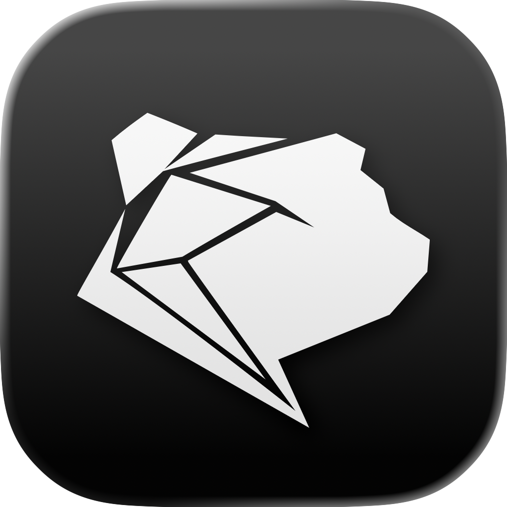
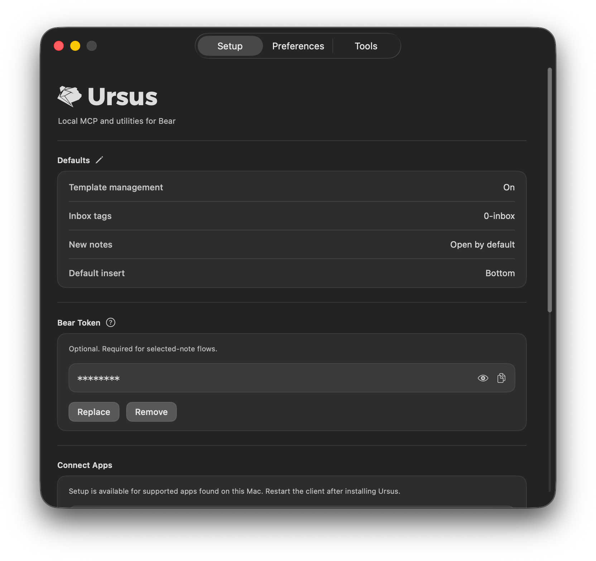
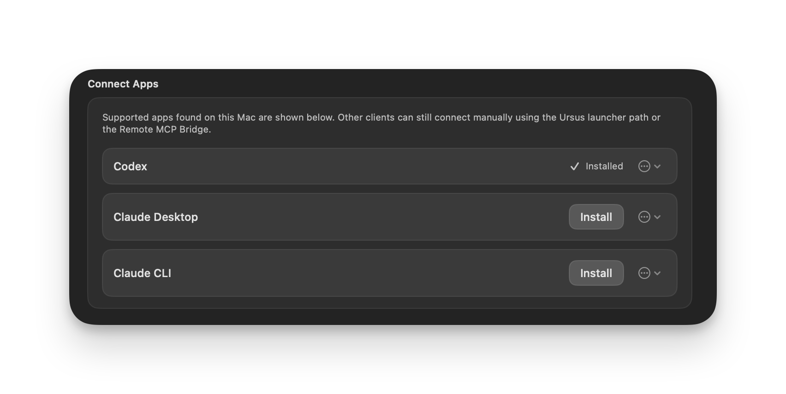
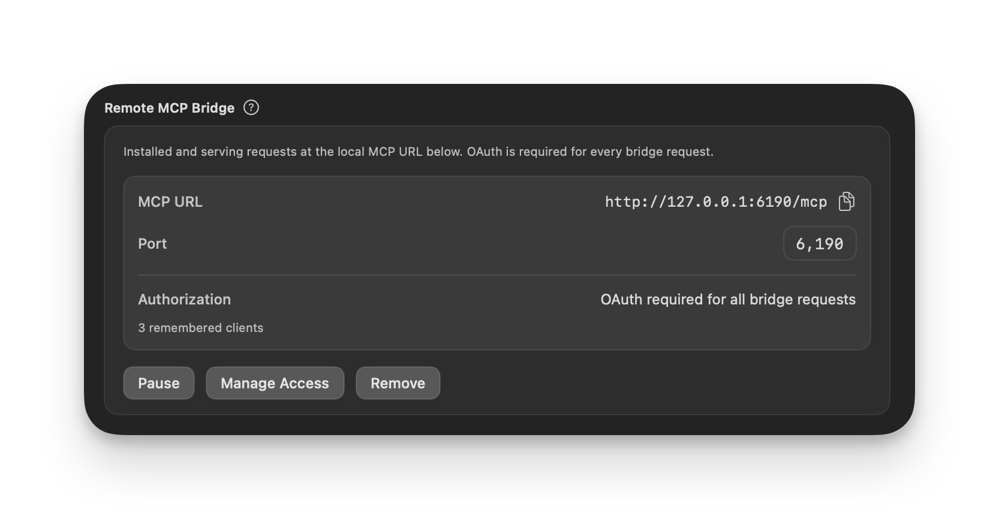

<h1 align="center">Ursus</h1>
<p align="center">
  <picture>
    
  </picture>
</p>
<p align="center"><strong>Local MCP, CLI, and utilities for Bear.</strong></p>
<p align="center">Drag it into Applications, open it once, and your AI apps that support MCP can now connect to Bear.</p>

---

## Requirements

- macOS 14 or later
- Bear installed

---

## Designed with a specific focus
*Ursus isn’t trying to do everything. It’s built around a deliberate way of working with Bear: inbox-first capture, template-aware editing, safe AI changes, and actually interacting with the note you’re already looking at.*

**It works with the note you already have open.**
If you add a Bear token, Ursus can target your currently selected note directly. Just say 'summarize my selected note' or 'proofread this selected note,' no need to tell it which note to find. Of course, you can also use the note title or ID to target something else specifically.

**It edits notes without breaking their structure.**
Ursus reads the note, plans the change locally, and sends a clean replacement through Bear's write path. That means it can insert before or after a heading, replace an exact string, or attach a file relative to a specific part of the note,  without scrambling your layout or template.

**It backs up notes before touching them.**
Bear has no version history. Ursus fills that gap with snapshots captured automatically before major note-rewriting operations. You can compare a backup to the current note in a compact default mode, ask for the full changed regions when needed, or restore from any saved point.

**The tools are batch-friendly.**
Ursus exposes a focused set across five areas: discovery, notes, tags, backups, and navigation. Most tools accept multiple operations in a single call.

**Discovery has real depth.**
Search by text, tags, date ranges, pinned state, todos, attachment content, and more. Mix filters in one query, or batch separate search hypotheses when terms may belong to different notes. Results paginate, so large searches don't flood your context.

**CLI and automation**
Create notes, back up, restore, and apply templates from the command line or any automation tool: Keyboard Maestro, Raycast, Alfred, BetterTouchTool, you name it.

<p align="center">
  <picture>
    <source media="(prefers-color-scheme: dark)" srcset="./docs/images/ursus-main-window-dark.png">
    <source media="(prefers-color-scheme: light)" srcset="./docs/images/ursus-main-window-light.png">
    
  </picture>
</p>


---

## What it includes

- **Discovery** — search notes by text, tags, dates, pinned state, todos, or attachment OCR content, with pagination
- **Notes** — create, insert, replace, and attach files, all template (and structure) aware
- **Tags** — list, add, remove, rename, and delete tags across Bear
- **Backups** — snapshot notes before edits, compare changes, and restore from any saved point
- **Navigation** — open notes and tags directly in Bear, archive notes

Reads come directly from Bear's local database. Writes go through Bear's x-callback-url path. Ursus never touches Bear's database directly.

---

## Install

1. Download the latest `Ursus.dmg`
2. Drag `Ursus.app` into `/Applications`
3. Open it once

Ursus installs a shared command at `~/.local/bin/ursus` — that's the stable path your MCP clients should use.

---

<p align="center">
  <picture>
    <source media="(prefers-color-scheme: dark)" srcset="./docs/images/ursus-connect-apps-dark.png">
    <source media="(prefers-color-scheme: light)" srcset="./docs/images/ursus-connect-apps-light.png">
    
  </picture>
</p>

## Connect your AI app

Ursus supports two connection styles.

**Local MCP clients** (Codex, Claude, etc.) use stdio. The **Setup** tab detects supported apps on your Mac and lets you connect them with one click.

If you prefer to configure things manually, or if your app is not directly supported by Ursus, the snippet you need would look like this

```json
{
  "type": "stdio",
  "command": "/Users/you/.local/bin/ursus",
  "args": ["mcp"]
}
```

**Remote or browser-based clients** use the optional HTTP bridge:

```text
http://127.0.0.1:6190/mcp
```

The bridge is loopback-only by default and includes built-in OAuth support. If you expose it through your own tunnel, you can require explicit client authorization rather than leaving it open. Keep in mind that for remote-only services like ChatGPT, the local `127.0.0.1` URL is just the starting point, not the whole setup.

<p align="center">
  <picture>
    <source media="(prefers-color-scheme: dark)" srcset="./docs/images/ursus-install-bridge-dark.png">
    <source media="(prefers-color-scheme: light)" srcset="./docs/images/ursus-install-bridge-light.png">
    
  </picture>
</p>

---

## First-time setup

Most users only need a minute inside the app.

- **Setup tab** — review defaults, add your optional Bear API token for selected-note workflows, and connect local AI apps or manage the HTTP bridge
- **Preferences tab** — set inbox tags, template behavior, tag merge behavior, backup retention, and discovery defaults
- **Tools tab** — enable or disable individual MCP tools if you want a narrower surface

---

## Updates

Ursus has built-in update support. You'll get notified when there's something new, and you can choose when to install. You can also manage this from Preferences or via CLI:

```bash
ursus update check
ursus update auto-install on|off
```

---

## Uninstall

To remove Ursus completely:

1. If you connected any AI apps, remove the Ursus entry from their config
2. If the Bridge is running or installed, select Remove in the Setup tab
3. Delete `Ursus.app` from `/Applications`
4. Remove the shared launcher: `rm -f ~/.local/bin/ursus`
5. Remove app data: `rm -rf ~/Library/Application\ Support/Ursus`

---

## There's more

This README covers the basics. For everything else:

- [MCP tools reference](./docs/tools.md)
- [CLI reference](./docs/cli.md)
- [Bridge and authorization](./docs/bridge.md)
- [Troubleshooting](./docs/troubleshooting.md)
- [Set as a Quick Action in Alter](./Support/scripts/alter-quick-note.scpt)

If you want to go deeper, clone the project, or see how things are wired internally:

- [Architecture](./docs/ARCHITECTURE.md)
- [Maintainer notes](./docs/MAINTAINER_NOTES.md)
