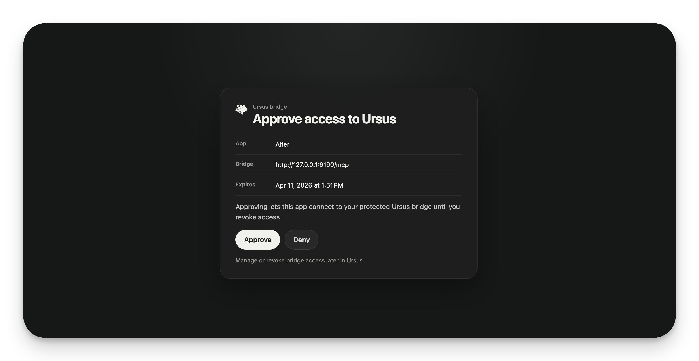
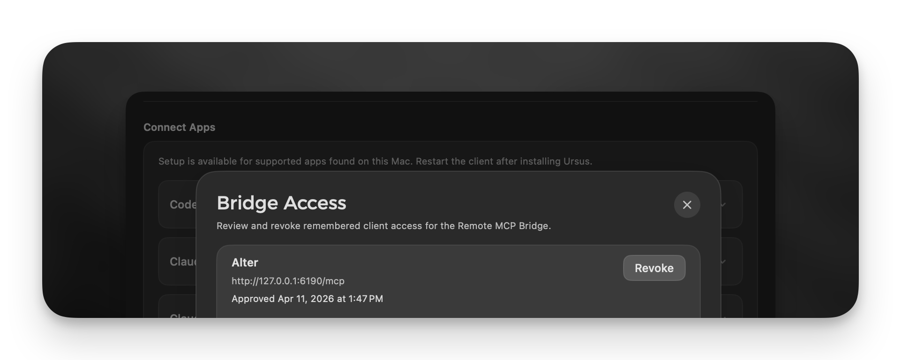

# Ursus HTTP Bridge & Authorization

Ursus connects directly to your AI apps via **stdio** (a standard, direct connection). It’s fast, private, and simple.

However, some AI applications don’t support this direct method, or you might want to use Ursus with remote tools. That’s where you can use the **HTTP Bridge**. It’s an optional feature that "mounts" Ursus as a local web server, allowing these apps to communicate with your notes over a standard URL.

  <picture>
    <source media="(prefers-color-scheme: dark)" srcset="./images/ursus-bridge-oauth-dark.png">
    <source media="(prefers-color-scheme: light)" srcset="./images/ursus-bridge-oauth-light.png">
    
  </picture>

---

## How It Works

Think of the bridge as a local translator. It keeps your notes secure on your Mac, but provides a standardized "front door" (an endpoint) that certain apps need to talk to your local tools.

*   **It’s always local:** By default, the bridge lives entirely on your machine. It talks only to your own apps, keeping everything private.
*   **Use the full endpoint:** The bridge URL needs the full MCP path, which is normally `/mcp`. In practice that means something like `http://127.0.0.1:6190/mcp`, not just `http://127.0.0.1:6190`.
*   **Automatic Startup:** When you set up the bridge, Ursus creates a **Launch Agent**. This is a small macOS system file that tells your Mac: *"Whenever I log in, make sure this bridge is running."* This ensures your setup stays consistent without you needing to manually open Ursus every single time you restart your computer.

---

## When should you use the bridge?

You generally **do not need the bridge** if your AI app supports local stdio connections (like Claude Desktop or Codex). It’s purely a convenience tool for apps that require or support a web-based (HTTP) connection instead.

---

## Security & Remote Access

Whether you use the standard `stdio` connection or the HTTP Bridge, your notes are never exposed directly. The bridge simply exposes your local tools on a loopback port (`127.0.0.1`), which is only reachable from your own computer.

### Connecting to the Web
If you want to use Ursus with a remote-only service like ChatGPT, you’ll need to make your bridge accessible from the web. You can do this by using a tunnel service—**Cloudflare Tunnel** is a great, user-friendly option for this.

In other words: the local bridge URL by itself is not enough for a remote-only service. You still need your own tunnel or other way to expose it safely.

**If you decide to expose the bridge to the internet, you should turn on OAuth Authorization in Ursus.**

*   **What is OAuth?** It’s a standard way for you to "approve" a connection. When enabled, your browser will ask you to authorize access before any AI app can talk to your bridge.
*   **Why use it?** Even if you aren't an expert, this acts as a digital key. Only apps you have explicitly authorized will be able to use Ursus tools to see or edit your notes, preventing unauthorized access. 

  <picture>
    <source media="(prefers-color-scheme: dark)" srcset="./images/ursus-bridge-access-dark.png">
    <source media="(prefers-color-scheme: light)" srcset="./images/ursus-bridge-access-light.png">
    
  </picture>

### Why this is an advantage
Using the bridge gives you the flexibility to use Ursus exactly how you want. You get the power of your local AI tools inside Bear, but you gain the ability to extend those workflows to whatever AI platform you prefer—all while keeping the "keys" to your notes firmly in your hands.

---

## Troubleshooting & Management

You don't need to be a programmer to manage the bridge. Ursus gives you simple controls in the **Setup** tab to:

*   **Start/Pause/Resume:** Control whether the bridge is active.
*   **Remove:** If you decide you don't need the bridge anymore, you can remove it in one click. This cleans up the Launch Agent and stops the bridge from running at login.
*   **Manage Access:** If you enabled OAuth, you can see exactly which apps have your "key" and revoke access at any time with a single click.

If you prefer the terminal, `ursus bridge status`, `ursus bridge print-url`, `ursus bridge pause`, `ursus bridge resume`, and `ursus bridge remove` cover the same basics.

It’s about giving you the convenience of a modern, web-connected workflow without sacrificing the "local-first" privacy that makes Bear such a great place for your thoughts.
